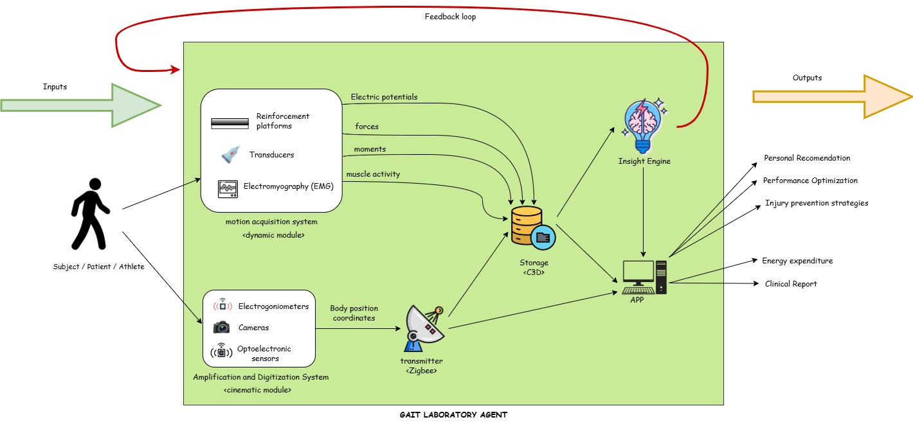
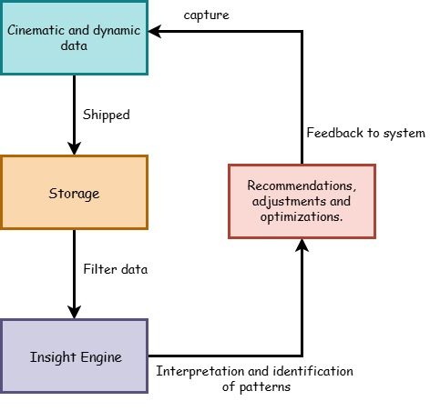

# 🤖 GAIT LABORATORY AGENT SYSTEMS DESIGN ✏️
This agent has a particular architecture, so is important to define all components, sensors, actuators, inputs, outputs, all of these help to design a system diagram with the relationships, modules and data flow.  
## System requeriments

[System requeriments document](Systems_requeriments.pdf)

## High-Level Architecture

 
### Motion Acquisition System (Dynamic module)
Motion Acquisition System is a module of the Gait Laboratory Agent that captures dynamic biomechanical signals from the body of a subject. These signals allow for analyzing how the body moves, how much force is applied, how muscles are activated, and how the musculoskeletal system reacts during gait or a specific physical activity.   
This module has the following **sensors**:
- **Reinforcement Platforms:** Measure the forces that the body exerts against the ground during walking. Identifying imbalances, gait patterns, or overload in any limb. Provides data like moments and force.
- **Transducers:** Transform physical signals (such as pressure or vibration) into electrical signals that can be analyzed. Allows for precise measurement of mechanical interactions, useful for detecting anomalies.
- **Electromyography (EMG):** Records the electrical activity of muscles as they contract. Detects muscle imbalances, levels of exertion, and coordination between muscles. Provides information about the electrical potentials that reflect muscle activation.

### Amplification and Digitization System (Cinematic module)
Cinematic Sensors are part of the Gait Laboratory Agent responsible for capturing the spatial and temporal aspects of body movement. These sensors provide essential data to understand how the body segments move in relation to each other during walking or physical activity. This module provides  spatial coordinates, joint angles, and segment trajectories that describe the body's movement.
This module includes the following sensors:
- **Cameras:** Track reflective markers placed on the subject’s body to determine joint positions, angles, and movement trajectories in 3D space. Enables highly precise motion analysis, detecting subtle gait deviations.
- **Electrogoniometers:** Measures joint displacement angles.
- **Optoelectronics:** Fiber optic technology to carry an input light signal that is modulated according to a measured object magnitude and then collected by a detector, conditioned and processed.

### Transmitter 
The Transmitter is responsible for sending the data collected by the Cinematic Module to both the App and the Storage System. This ensures that the captured motion data is not only preserved but also immediately accessible for visualization and interaction by users.

### Storage 
Electrogoniometers that measure joint displacement angles. Optoelectronics fiber optic technology to carry an input light signal that is modulated according to a measured object magnitude and then collected by a detector, conditioned and processed.

### Insight Engine
Is the intelligent module of the Gait Laboratory Agent responsible for analyzing the processed motion data and extracting meaningful insights. It simulates reasoning processes to identify patterns, anomalies, or performance metrics that inform diagnoses and personalized recommendations. Also, use advanced algorithms (Q-learning and DQN).

### APP (Actuator)
The mobile app is the primary interface between the user and the Gait Lab Agent. It presents the data collected and analyzed by the system in a clear and interactive manner, facilitating the understanding and application of complex biomechanical information. 

### Feedback Loops
In this system there is just one feedback loop, which is described by the following diagram:

## Preliminary Implementation Outline
Gymnasium and Stable-Baselines3 are identified as suitable frameworks for the implementation of reinforcement algorithms. Gymnasium allows the creation of customized environments that simulate human gait, while Stable-Baselines3 offers efficient implementations of Q-Learning and DQN, facilitating agent training and evaluation.
[Preliminary implementation document](Preliminary_Implementation_Outline.pdf)
