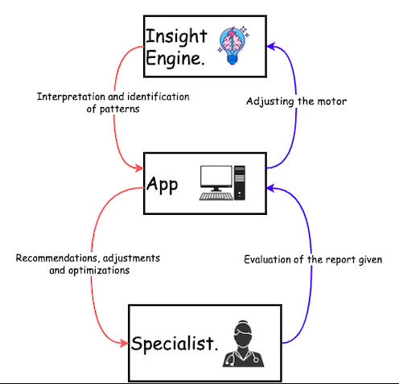

# 🤖 Dynamical Systems Analysis & Design✏️
This agent has a particular architecture, so is important to define all components, sensors, actuators, inputs, outputs, all of these help to design a system diagram with the relationships, modules and data flow.  
## ✅  System Dynamics Analysis
The requirements section defines how sensors, transmitters and reward functions are integrated within the gait lab environment. It also describes the main use cases, focusing on the interactions between the agent and the environment to achieve goals such as adaptive learning, improved user performance, and personalization of clinical reports.  

## Feedback Loop Refinement
El sistema ahora cuenta con dos nuevos ciclos de retroalimentación. El primero esta presente en el Insight engine, en este se ajusta a sí mismo con base en los datos que va procesando y los resultados que va generando hasta el punto en el que puede llegar a considerarse como autoaprendizaje por parte del elemento. Por otro lado, el segundo ciclo consite en una señal dada por un elemento externo considerado especialista, indicando que tan buenos son los resultados del Insight engine. Este ultimo ciclo, se puede considerar una señal de recompensa que indica con precisión y en tiempo real cuán buena fue una recomendación en una caso especifico.  

![Feedback_loop_InightEngine][def]
## Stability and Convergence
Dentro del sistema se consideran aspectos de estabilidad que buscan control y mejora del objetivo, uno de estos es la estabiidad BIBO(Bounded Input, Bounded Output) que se refiere a que cualquier entrada acotada espera una salida acotada de igual forma. Es decir que, en nuestro agente se esperan recomendaciones centradas en los aspectos fisicos, dado que la entrada del sistema en su mayoria son datos fisicos del paciente. Por otro lado, el motor del agente del sisema comienza siendo entrenado, con esto la experiencia, el tiempo y las señales de recompensa presentan un comportamiento convergente puesto que sus salidas se van a ir extabilizando mientras aprende y disminuye su cantidad de errores. De igual forma, si los resultados fisicos de los pacientes mejoran gracias a las recomendaciones del sistema, esto nos idica que las salidas del sitema se van estabilizando.  

[def]: diagrams/feedback_insightengine.png