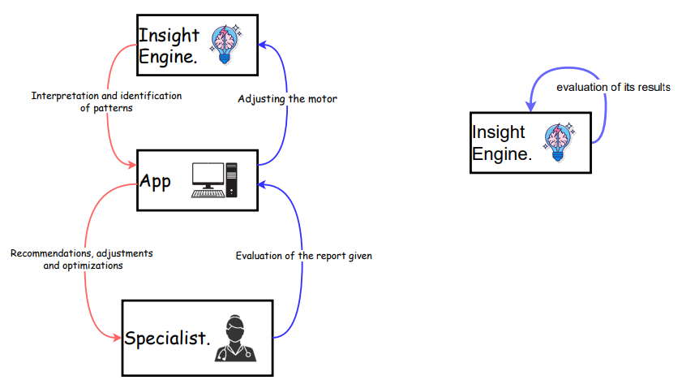

# 🤖 DYNAMICAL SYSTEMS ANALYSIS & DESIGN ✏️
The goal of the workshop is to integrate systems science and cybernetic theory into the autonomous agent, focusing on real-time changes, feedback loops, and nonlinear behaviors.  

To support this, the system diagram was updated: feedback loops were adjusted, adaptive logic was added to the Insight Engine, an external actor (specialist) was included to supervise and evaluate the system's recommendations, and new key inputs—such as training data and the patient's medical history—were incorporated to improve the walker's suggestions. \\
**To see all Workshop report:**

\\
**To see Workshop Report Document:**
📍[Workshop 2 report](Workshop_2_report.pdf)
## 🌀 System Dynamics Analysis 🌀
### Causal Model as a Basis for Simulation
The causal model represents a complex sensor-assisted gait assessment system, highlighting key components like data collection, storage, processing via the Insight Engine, and personalized feedback to the patient. 

It enables the identification of feedback loops, nonlinear relationships, and temporal dependencies, supporting the analysis of system behavior over time—even without detailed quantitative simulations.

#### 📊 Non-linear Factors
The model identifies several nonlinear relationships, where the effect is not directly proportional to the cause:

- **Fatigue vs. Patient Gait:**
Fatigue impacts gait quality in a nonlinear way. Initially, small increases in fatigue have little effect, but once a physiological threshold is crossed, gait deteriorates rapidly. Early detection is crucial, as delays can lead to serious consequences like falls or injury.

- **Environment vs. Data Collection:**
Environmental changes (e.g., lighting, temperature) may have minimal impact at first, but beyond certain limits, they significantly degrade sensor accuracy. For example, a slight drop in lighting may be tolerable, but a sharp drop can cause major data loss.

- **Personalization vs. Intervention Effectiveness:**
As the system gathers more patient-specific data, small personalized adjustments become increasingly effective. The benefit of personalization grows nonlinearly, with greater impact once the system better understands the individual.

### ⏱️ Time-Dependent Factors
They are those that change over time and whose evolution influences the behavior of the system.

- Level of fatigue: Increases or decreases according to sleep, physical activity and habits, and changes constantly with the patient's condition.
- Muscle activity: Varies over time depending on physical condition, injuries and gait quality.
- Patient gait: Evolves progressively with the patient's condition, fatigue, injuries and recommendations.
- Injuries: Accumulates or decreases over time depending on activity and effectiveness of recommendations.
- Storage capacity: Changes dynamically as more data is collected and processed.
- Sensor quality: May degrade with use or change due to maintenance/calibration over time.
- Environment: Although external, its conditions (temperature, light, interference) are constantly changing and impact the system.
- Data collection: Occurs continuously during monitoring, affecting system dynamics.
- Personal Recommendation: Changes over time according to new data, feedback and system learning.
- Insight Engine processing: Evolves according to the volume and quality of data received and accumulated personalization.

## 🔄 Feedback Loop Refinement 🔄
The system now includes two new feedback cycles. The first is within the Insight Engine, which adjusts itself based on the data it processes and the outcomes it generates—functioning as a form of self-learning. The second feedback loop involves an external specialist, who evaluates the quality of the Insight Engine’s recommendations. This external input acts as a real-time reward signal, indicating how effective each recommendation was in a specific case. 

### Stability and Convergence
The system applies the concept of BIBO (Bounded Input, Bounded Output) stability, meaning that bounded (limited) inputs should lead to similarly bounded outputs. Since the agent primarily receives physical data from the patient, it is expected to generate physical, focused recommendations. Additionally, as the agent is still in training, its behavior is convergent—over time and with reward signals, its outputs become more stable and accurate, with fewer errors. Improvements in patient outcomes further indicate that the system’s outputs are stabilizing effectively.  

## Iterative Design Outline
The project plan was updated with new data structures, frameworks and algorithms that would be applied to implement advanced dynamic behaviors in the gait agent. Also, how we can test these dynamics.  
